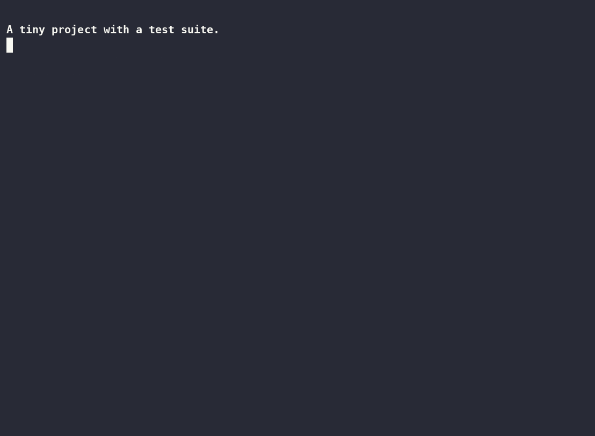

# blindspot

**Your agent wrote 200 lines and says the tests pass. Which of those lines would
a test actually catch a bug in?**



[](https://github.com/jlee844/blindspot/actions/workflows/tests.yml)
[](pyproject.toml)
[](pyproject.toml)
[](LICENSE)


Coverage answers a weaker question than everyone reads it as. It tells you a line
*ran*. It does not tell you anything **asserted** on it — and a line that runs
while nothing checks it is exactly the line an agent gets away with.

blindspot takes your diff, breaks each changed line on purpose, and re-runs only
the tests that touch it. A line counts as verified when a test actually fails.

```bash
git clone https://github.com/jlee844/blindspot && cd blindspot
pip install -e .

blindspot                              # working tree vs HEAD
blindspot --rev main                   # a whole branch
blindspot --tests "pytest -q tests/unit"
```

```
  2 changed lines

  GUARDED  parser.py:136   (3 tests touch it)
           changed or -> and     caught by 3 test(s)
  BLIND    client.py:267   (2 tests touch it)
           changed 40 -> 41      no test failed when broken

  guarded 1 · blind 1 · untested 0

  1 line(s) ran during the tests and nothing failed when broken.
  Coverage would call these covered.
```

## See it in 10 seconds

```bash
./demo.sh
```

Builds a throwaway project with two one-line changes — a discount threshold and
a shipping threshold — and asks which one a test would actually catch:

```
GUARDED  pricing/rules.py:2   changed >= -> <     caught by 2 test(s)
BLIND    pricing/rules.py:8   changed 60 -> 61    no test failed when broken
```

Both lines are covered. Coverage reports 100%. One of them is checked by a real
assertion; the other is only reached by `assert shipping(10) is not None`,
which runs the line and verifies nothing.

The demo cleans up after itself — it works in a temp directory and touches
nothing you own.

## The four verdicts

| verdict | meaning |
|---|---|
| **GUARDED** | broke it, a test failed. This line is genuinely verified. |
| **BLIND** | broke it, every test still passed. **Coverage calls this covered.** |
| **UNTESTED** | no test executes this line at all |
| n/a | nothing meaningful to break — a string, an import, a bare assignment |

**BLIND is the whole product.** It is the gap between "covered" and "verified",
and it is invisible to every coverage tool.

## Why it is fast enough to run on every PR

Mutation testing is famously too slow to use. blindspot is not doing mutation
testing — it is doing mutation testing **scoped to the diff**:

- only lines the diff touched, not the codebase
- one conservative mutation per line, not a full operator matrix
- **only the tests that cover that line**, found via per-test coverage contexts

On a 257-test suite, a two-line change resolves in about a second.

## Real example

Run against its author's own project, on two lines that coverage reported as
fully covered:

```
BLIND  claims.py:236   changed 80 -> 81   no test failed when broken
BLIND  claims.py:267   changed 40 -> 41   no test failed when broken
```

Both are arbitrary caps — an 80-character probe, a 40-file search limit. Both
execute during the suite. Neither is pinned by anything. That is the class of
constant an agent picks freely and no one notices.

## In CI

```bash
blindspot --rev origin/main --fail-on-blind
```

Exits 1 if any changed line runs unasserted. Start with it off, look at the
output for a week, then decide whether you want it blocking.

## Scope, stated plainly

- **Python and pytest.** The diff and report layers are language-agnostic; the
  coverage and mutation layers are not.
- **Mutations are conservative** — comparison flips, boolean flips, `and`/`or`,
  integer off-by-one. Anything that breaks syntax is discarded rather than
  reported.
- **A GUARDED verdict is evidence, not proof.** It shows *one* mutation was
  caught. It does not prove the line is fully specified.
- **It edits files in place while testing** and restores them in a `finally`.
  Commit before running it on work you cannot lose.
- Needs a git repo and a test suite that passes before you start. A red suite
  makes every verdict meaningless.

## Tests

```bash
python -m pytest tests/ -q     # no suite runs, no network
```

Two are regressions for bugs this tool shipped with, both of which made it
silently report nothing: a `FileDiff` with `__len__` is falsy when empty, so
`if cur:` dropped every file before reading its hunks; and checking a mutation's
syntax absolutely — rather than against the original — discards every mutation,
because a bare indented line never parses on its own.

## Why this exists

Coverage kept telling me lines were covered that nothing asserted on. The full
write-up, including five failed attempts at a harder version of the problem, is
[here](https://github.com/jlee844/receipt/blob/main/FINDINGS.md).

## Status

Not on PyPI yet — install from source as above. Python 3.9 – 3.14, tested on each by CI.

---

## Part of a set

Four small tools that read what an AI coding session actually did, rather than
what it said it did. Each stands alone; together they cover a session end to
end.

| | |
|---|---|
| [**mission**](https://github.com/jlee844/agent-mission) | the goal, beside the work, that the agent cannot quietly rewrite — plus one live board for every running session |
| [**receipt**](https://github.com/jlee844/receipt) | what a session did, what it cost, and which of its claims are backed by the filesystem |
| **blindspot** *(you are here)* | which lines in a change a test would actually catch a bug in — coverage says a line ran, not that anything asserted on it |
| [**transcript-audit**](https://github.com/jlee844/transcript-audit) | profile a corpus of agent transcripts before computing any statistic over it |
